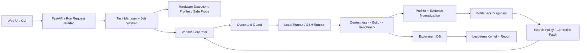

# TileLang Remote Autotuning Agent

[](https://www.python.org/)
[](LICENSE)

TileLang Remote Autotuning Agent 是一个面向 TileLang kernel 的远程自动调优系统。它把 sample 物化到隔离 workspace，在本地或 SSH 容器中执行 correctness、build 和 benchmark，记录失败与性能证据，并在给定搜索预算内返回实际运行过且通过正确性检查的 **best-seen kernel**。

本项目不承诺全局最优，也不会把合成 fixture、缺失的 profiler 指标或推测值包装成真实硬件证据。

## 项目状态

当前开发主线是 `v2/evidence-guided-agent`，包含两类入口：

- **Web API 主流程**：FastAPI 已支持设置、硬件解析、任务创建、进度查询、结果读取、下载和取消任务。
- **CLI 高级模式**：保留 V2 run request 和传统 V1 config，适合开发、调试与回归测试。

当前仍需注意：

- `python -m kernel_opt_agent.server.app` 只启动 API，尚未同源托管 `frontend/index.html`。
- 单文件前端调用相对路径 `/api/*`，需要同源代理或同源托管才能完成浏览器闭环。
- Web 请求当前只开放 `rule_based`、`latency` 和 `dummy` profiler；底层 CLI 支持更完整的搜索与 profiler 类型。
- C500 Paged Attention 目前只有采集/导入脚手架；真实采集仍受远端 SSH session channel 阻断，不能当作真实性能基线。

## 能做什么

| 能力 | 当前实现 |
| --- | --- |
| Sample 输入 | inline、后端可访问的 path；浏览器目录上传尚未接通 |
| Runner | local mock/test、SSH password、SSH key 兼容路径 |
| 参数模板 | `{{BM}}`、`{{BN}}` 等占位符，只渲染 entry 文件 |
| 搜索策略 | 核心支持 grid、random、rule-based、LLM、hybrid；Web 当前固定 rule-based |
| 正确性门禁 | 每个候选都必须通过 correctness，失败候选不参与排名 |
| Benchmark | 解析 latency、TFLOPS、bandwidth，保存原始 stdout/stderr |
| 硬件信息 | 用户覆盖、远程探测、内置 profile、安全 probe、保守未知模式 |
| Profiler | dummy、TileLang 日志、MXMACA/mcProfiler 解析接口 |
| 证据诊断 | 输出瓶颈类型、置信度、证据、不确定性和建议动作 |
| 受控 Patch | 仅修改标记区域，执行验证并回滚；Web 默认未启用 |
| 结果产物 | best kernel/config、CSV、JSONL、报告、失败记录和日志 |

## 用户需要提供什么

最小任务输入包括：

1. TileLang sample 和 entry 文件。
2. GPU 型号；不确定的硬件字段允许保持 `null`。
3. `build_command`、`correctness_command`、`benchmark_command`。
4. 搜索预算和目标。
5. 远程模式下的 SSH host、port、username、workspace，以及通过环境变量提供的密码。

LLM 是可选能力。API key 只能通过 `llm.api_key_env` 指向的环境变量读取，不能写入配置或日志。

## 系统架构



当前 trial 的实际执行顺序是 **correctness -> build -> benchmark**。correctness、build、运行或解析失败都会形成结构化记录；单个候选失败不会终止整个搜索。

更详细的模块、数据流和扩展点见：

- [技术架构](docs/technical-architecture.md)
- [HTTP API 参考](docs/http-api.md)
- [开发说明书](instruction.md)

## 安装

要求 Python 3.10+。

```bash
git clone https://github.com/cc-c122/TileLang-Remote-Autotuning-Agent.git
cd TileLang-Remote-Autotuning-Agent
python -m venv .venv
```

PowerShell：

```powershell
.venv\Scripts\Activate.ps1
pip install -e .
```

bash：

```bash
source .venv/bin/activate
pip install -e .
```

也可以安装已发布的 V1.0.0-rc1 wheel：

- [Release 页面](https://github.com/cc-c122/TileLang-Remote-Autotuning-Agent/releases/tag/v1.0.0-rc1)
- [直接下载 wheel](https://github.com/cc-c122/TileLang-Remote-Autotuning-Agent/releases/download/v1.0.0-rc1/tilelang_remote_autotuning_agent-1.0.0rc1-py3-none-any.whl)

该预发布包定位为 V1 MVP，不包含开发主线的全部 V2 Web 能力。

## 启动 Web API

```bash
python -m kernel_opt_agent.server.app
```

默认监听 `http://127.0.0.1:8765`。健康检查：

```bash
curl http://127.0.0.1:8765/api/health
```

主要端点：

```text
GET  /api/health
GET  /api/settings
POST /api/settings
POST /api/settings/test-connection
POST /api/hardware/resolve
POST /api/tasks
GET  /api/tasks
GET  /api/tasks/{task_id}
GET  /api/tasks/{task_id}/events
GET  /api/tasks/{task_id}/results
POST /api/tasks/{task_id}/cancel
GET  /api/tasks/{task_id}/download/best_kernel
GET  /api/tasks/{task_id}/download/report
```

请求模型、示例和状态码见 [HTTP API 参考](docs/http-api.md)。

## 本地可复现 Demo

不需要 GPU 或 SSH：

```bash
python main.py --config kernel_opt_agent/config.example.yaml
```

或者使用 V2 文件驱动高级模式：

```bash
cp examples/settings.yaml.example settings.yaml
python main.py --run-request examples/run_request.yaml --settings settings.yaml
```

配置文件是 CLI 的高级/调试入口，不是 V2 普通用户产品入口。

## 远程 SSH 设置

SSH 密码和 LLM API key 不保存明文，只保存环境变量名。

PowerShell：

```powershell
$env:KERNEL_AGENT_SSH_PASSWORD = "your-ssh-password"
$env:OPENAI_API_KEY = "your-api-key"
```

bash：

```bash
export KERNEL_AGENT_SSH_PASSWORD="your-ssh-password"
export OPENAI_API_KEY="your-api-key"
```

SSH password 配置示例：

```yaml
remote:
  host: example.com
  port: 22
  username: root
  auth_type: password
  password_env: KERNEL_AGENT_SSH_PASSWORD
  remote_workspace: /tmp/kernel_opt_workspace
```

所有远程命令默认等价于：

```bash
cd <remote_workspace> && <user_command>
```

需要在子目录运行时，应在命令中显式写安全的相对路径，例如 `cd samples/moe_gemm && python benchmark.py`。

## 模板与搜索空间

V1/CLI 模板使用双花括号：

```python
BM = {{BM}}
BN = {{BN}}
NUM_THREADS = {{NUM_THREADS}}
```

对应搜索空间必须显式、有边界且非空：

```yaml
search_space:
  BM: [16, 32, 64]
  BN: [32, 64, 128]
  NUM_THREADS: [128, 256]
```

LLM、random 和规则 fallback 都不能选择搜索空间外的值。若模板仍有未替换占位符，任务会失败并记录原因。

## 输出文件

Web 任务写入独立目录：

```text
kernel_opt_agent/workspace/tasks/{task_id}/
  run_request.yaml
  effective_config.yaml
  sample/
  generated/
  patches/
  results/
```

常用结果：

| 文件 | 含义 |
| --- | --- |
| `best_kernel.py` | 当前预算内 best-seen kernel |
| `best_config.yaml` | best-seen 完整参数 |
| `report.md` | 基线、最佳结果、诊断、patch 与不确定性 |
| `summary.csv` / `all_results.csv` | 全部候选汇总 |
| `experiments.jsonl` | trial 级结构化记录与完整参数 |
| `failed_cases.jsonl` | correctness/build/run/parse/guard 失败 |
| `profiler_results.jsonl` | profiler 结果或采集失败信息 |
| `metric_observations.jsonl` | 标准化性能证据 |
| `diagnosis.jsonl` / `diagnoses.jsonl` | 诊断记录 |
| `patch_trials.jsonl` | 受控 patch 验证记录 |
| `logs/` | 原始 stdout/stderr |

缺失指标保持 `null`；`available_metrics`、source 和 confidence 用来说明证据是否可用以及来自哪里。

## 安全模型

- 用户命令必须经过 `runner/command_guard.py`。
- runner 的 cwd 必须位于指定 workspace 内。
- 禁止 `rm -rf`、`mkfs`、`dd if=`、系统包移除、关机重启、`curl | sh`、`chmod 777 /` 等危险命令。
- SSH runner 只清理带 `.kernel_opt_agent_workspace` 标记的受管目录。
- 每条命令有 timeout，并捕获 stdout、stderr、return code 和失败类别。
- 明文 password、API key、token、私钥内容会被拒绝或脱敏。
- LLM 只能输出经 schema 校验的参数或受控 patch，不能直接执行 shell。
- patch 只能修改显式标记区域；失败或性能下降不会替换 best kernel。

command guard 是纵深防御的一层，不应替代低权限容器、网络隔离和最小权限 SSH 账户。

## 目录结构

```text
.
├── README.md
├── LICENSE
├── NOTICE
├── instruction.md
├── docs/
│   ├── technical-architecture.md
│   └── http-api.md
├── examples/
├── tests/
└── kernel_opt_agent/
    ├── agent/          # LLM planner 与搜索策略
    ├── benchmark/      # correctness/benchmark 解析
    ├── diagnosis/      # 证据模型与瓶颈规则
    ├── frontend/       # 当前单文件 Web UI
    ├── hardware/       # 探测、profile 与 safe probe
    ├── kernel/         # 模板渲染与参数候选
    ├── patcher/        # 受控 patch、校验和回滚
    ├── profiler/       # profiler 接口与 mcProfiler 导入
    ├── runner/         # local/SSH runner 与 command guard
    ├── server/         # FastAPI、任务管理和 worker
    ├── storage/        # JSONL/CSV/报告
    └── workspace/      # 运行产物，不应提交
```

## 开发与验证

```bash
python -m compileall -q kernel_opt_agent tests
python -m unittest discover -s tests
git diff --check
```

提交前不要加入真实 settings、SSH key、password、API key、token、本地 workspace 或未脱敏的远程日志。

## 开源许可

Copyright 2026 cc-c122.

本项目以 [Apache License 2.0](LICENSE) 开源。你可以在许可证条款允许的范围内使用、复制、修改和分发本项目。分发修改版本时需保留许可证和版权声明，并明确标注修改；许可证不提供商标授权，也不对软件作任何担保。

第三方源码仍遵循其各自许可证。例如 vendored TileLang Paged Attention sample 的 MIT 声明见 `kernel_opt_agent/samples/paged_attention_decode/THIRD_PARTY_NOTICES.md`。
