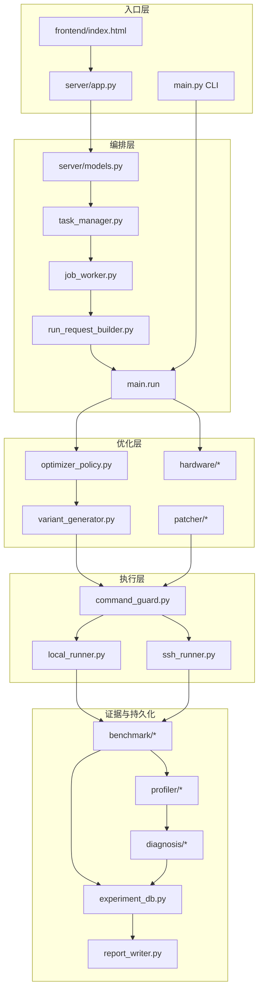
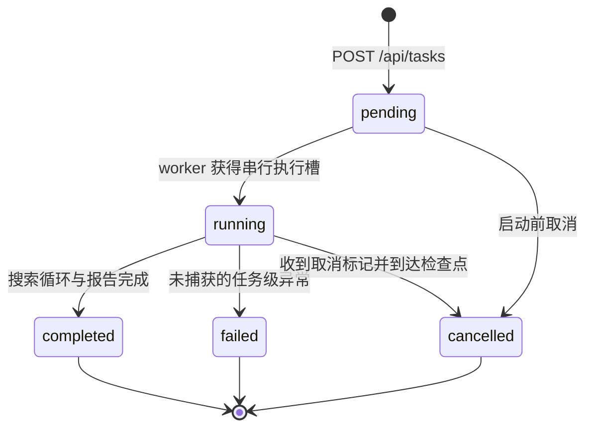
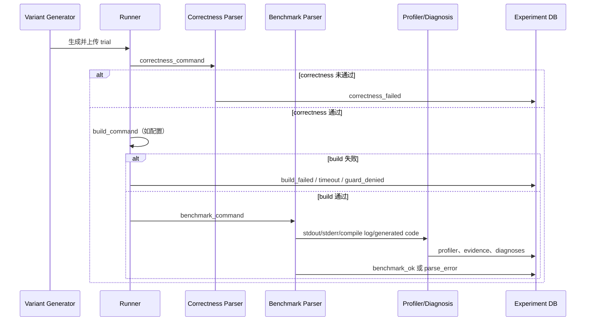

# 技术架构

本文描述默认 `main` 分支中 V2 实现的模块边界、任务生命周期、数据模型、安全约束和扩展方式。它记录的是仓库中的实际行为，不代表尚未实现的产品承诺。

## 1. 设计目标

系统的核心目标是让一次 kernel 优化具备以下性质：

- **可运行**：local runner 可完成 mock/demo/test，SSH runner 可在远端 workspace 执行。
- **可复现**：候选参数、patch、stdout/stderr、运行状态和环境信息落盘。
- **正确性优先**：未通过 correctness 的候选不能进入性能排名。
- **失败隔离**：编译、运行、解析和正确性失败只淘汰当前 trial。
- **证据驱动**：诊断必须引用已采集指标，并携带 source、confidence 和 uncertainty。
- **边界明确**：搜索和 LLM 不能越过 search space；patch 不能越过授权区域。
- **密钥最小暴露**：配置只保存环境变量名或 key path，不保存明文 secret。

非目标：

- 不证明或承诺全局最优。
- 不在硬件指标缺失时伪造理论上限或 profiler 数据。
- 不向 LLM 暴露任意 shell 执行能力。
- 不把 synthetic parser fixture 当作真实硬件实验。

## 2. 分层架构



### 2.1 入口层

- `frontend/index.html`：当前单文件 UI。普通路径应通过 HTTP API 创建和观察任务；开发者模式保留文件驱动入口。
- `server/app.py`：FastAPI 路由、结果聚合和下载接口。
- 根目录 `main.py` / `kernel_opt_agent/main.py`：CLI 和核心搜索循环。

### 2.2 编排层

- `server/models.py`：HTTP 请求模型。Pydantic 使用 `extra="forbid"`，拒绝未声明字段。
- `server/run_request_builder.py`：把 Web 请求转换为内部 `AppConfig`，同时生成审计用 run request/effective config。
- `server/task_manager.py`：任务状态、事件和取消标记。
- `server/job_worker.py`：后台线程执行任务。当前使用全局 `WORKER_LOCK`，任务串行进入 runner，避免共享全局路径相互污染。

### 2.3 优化层

- `agent/optimizer_policy.py`：grid、random、rule-based、LLM 和 hybrid 候选策略。
- `kernel/variant_generator.py`：验证模板占位符，生成候选文件和 patch 快照。
- `hardware/*`：硬件字段合并、远程探测、内置 profile 和 safe probe。
- `patcher/*`：patch region 解析、提案校验、运行、消融和回滚。

### 2.4 执行层

- `runner/local_runner.py`：在 trial workspace 中以 subprocess 执行，作为正式 mock/demo/test runner。
- `runner/ssh_runner.py`：Paramiko SSH/SFTP，实现上传、执行和结果拉回。
- `runner/command_guard.py`：所有本地/远程用户命令执行前的安全门禁。

### 2.5 证据与持久化

- `benchmark/correctness.py`：解析强约定 correctness 输出。
- `benchmark/parser.py`：按配置 regex 解析 latency、TFLOPS 和 bandwidth。
- `profiler/base.py`：统一 `ProfilerResult` 和 `MetricObservation`。
- `profiler/mcprofiler/*`：发现、校验和导入已有 mcProfiler Case。
- `diagnosis/*`：证据标准化和瓶颈规则。
- `storage/experiment_db.py`：JSONL、CSV 和日志落盘。
- `storage/report_writer.py`：最终报告与 best-seen 产物。

## 3. HTTP 任务生命周期



典型事件顺序：

1. `task_created`
2. `task_queued`
3. `sample_uploaded`
4. `hardware_resolved`
5. `build_started`（此事件当前表示正在构建内部 run request）
6. `correctness_started`
7. `benchmark_started`
8. `profiling_started`（启用时）
9. `trial_completed`
10. `profiler_parsed` / `diagnosis_completed`（存在可用证据时）
11. `best_updated`
12. `report_generated`
13. `task_completed`、`task_failed` 或 `task_cancelled`

事件是进度提示，不是单个命令的审计替代物；trial 级真实结果以 JSONL 和日志为准。

## 4. Trial 执行协议

对每个候选，核心流程为：



当前代码实际先执行 correctness，再执行 build。这与常见 build-first 流程不同，修改该顺序需要单独设计迁移和回归测试，文档不会把它描述成 build-first。

候选状态至少可能包括：

- `benchmark_ok`
- `correctness_failed`
- `build_failed` / `build_timeout`
- `run_failed` / `run_timeout`
- `parse_error`
- `guard_denied`
- `ssh_connection_failed`
- `sftp_upload_failed`
- `runner_exception`

只有 `benchmark_ok` 且 objective 非空的候选可参与 best-seen 排名。

## 5. 模板、搜索与复现

### 5.1 模板

V1/CLI 使用 `{{NAME}}` 占位符。sample 可以是目录，但只渲染配置的 `entry_file`；其余文件原样复制。生成器必须拒绝：

- 未在 search space 声明的占位符。
- 渲染后仍存在的占位符。
- 不符合 `allowed_file_patterns` 的目标文件。

### 5.2 搜索

- `grid`：确定性笛卡尔积枚举。
- `random`：仅从声明空间采样，使用固定 seed 保持可复现。
- `rule_based`：结合硬件和 safe probe 选择保守候选。
- `llm`：OpenAI-compatible Chat Completions，严格 JSON/Pydantic 校验。
- `hybrid`：LLM 失败后按规则和确定性策略补齐。

LLM 不能扩展 search space，也不能返回 shell command。

### 5.3 可复现记录

每个 trial 记录：

- 完整参数和 `config_hash`
- run/iteration/candidate/trial id
- correctness 与 metrics
- profiler、标准化 evidence 和 diagnoses
- kernel、patch、trial config、stdout、stderr 路径
- 错误类别与时间戳

best-seen 只表示当前预算内已执行候选的最好结果。

## 6. 硬件信息模型

硬件字段按优先级合并：

```text
user_config > remote_detection > builtin_profile > doc_lookup > safe_probe > unknown
```

每个字段必须携带：

- `value`
- `source`
- `confidence`
- 可选说明或 warning

用户覆盖不会被自动探测覆盖。safe probe 只说明 search space 中某个候选可能可用或不可用，不能声明官方理论上限。关键字段仍未知时启用 conservative mode。

当前 Web `/api/hardware/resolve` 主要合并用户覆盖和 builtin profile；LLM/web lookup 参数目前只返回“未使用”的 warning。底层 CLI 探测能力不能被误写成 Web 已完成联网硬件查询。

## 7. Profiler 与证据模型

`ProfilerResult` 的指标包括 latency、TFLOPS、估算带宽、寄存器、shared/private memory、occupancy、warp active、HBM 读写、bank conflict、访存合并效率和 MXMACA 扩展字段。

规则：

1. 获取不到的指标为 `null`。
2. `available_metrics` 明确标记字段是否可用。
3. 每条 observation 保存 source field、unit、source、confidence、artifact 和 parse warning。
4. diagnosis 保存 bottleneck type、confidence、evidence、uncertainty 和 recommended actions。
5. 证据不足时返回 `insufficient_evidence` 或低置信度诊断，不做确定结论。

mcProfiler import 会校验 Case artifact 并保留 SHA256/provenance。`tests/fixtures/.../synthetic_*` 只用于解析回归，不能进入真实性能报告。

## 8. 受控 Patch

允许修改的源码区域：

```python
# BEGIN_AGENT_PATCH: compute
# authorized body
# END_AGENT_PATCH
```

patch 提案至少包含 optimization name、target region、hypothesis、expected improvement、risk 和 replacement/diff。验证链包括：

1. region 与路径检查
2. 危险代码片段检查
3. 语法检查
4. build
5. correctness
6. benchmark
7. 保存结果并 rollback

当前 controlled patch trial 始终回滚实验修改，不会自动覆盖参数搜索得到的 `best_kernel.py`。这是安全实验能力，不等同于已经完成的全自动 LLM 代码优化。

## 9. Workspace 与安全边界

### 9.1 本地

- 每个 Web task 使用 `workspace/tasks/{task_id}`。
- inline sample 只能写入任务 sample 目录。
- entry file 必须是 workspace 内的相对路径，拒绝绝对路径和 `..`。

### 9.2 远程

- 命令执行语义为 `cd <remote_workspace> && <command>`。
- workspace 路径经过安全检查，不能是 `/`、`/root`、`/tmp` 等高风险根路径。
- runner 仅清理带 `.kernel_opt_agent_workspace` 标记的受管目录。
- 上传和下载使用 SFTP，下载范围限定为约定结果路径。

### 9.3 命令与密钥

- command guard 拒绝已知危险片段、系统路径重定向和跳出 workspace 的破坏性操作。
- settings 拒绝 `password`、`api_key`、`token`、`private_key` 等明文字段。
- password/API key 只通过环境变量读取。
- 错误、日志、结果和 API 返回需要脱敏。

command guard 不是完整 shell sandbox。生产部署仍应使用低权限账户、隔离容器、受限网络和专用 workspace。

## 10. 持久化契约

`workspace/tasks/{task_id}/results` 是一次 Web 任务的事实来源。主要文件：

- `experiments.jsonl`：完整 trial 记录。
- `summary.csv`：用于列表、排名和概要展示。
- `failed_cases.jsonl`：失败 trial。
- `profiler_results.jsonl`：profiler 原始结构。
- `metric_observations.jsonl`：标准化 evidence。
- `diagnosis.jsonl` / `diagnoses.jsonl`：规则诊断。
- `patch_trials.jsonl`：patch 实验。
- `best_kernel.py` / `best_config.yaml`：best-seen 产物。
- `report.md`：人类可读报告。

写入 JSONL 时应逐条追加，任何单条失败都不能破坏此前记录。API 聚合层不得从 `benchmark_ok` 推断未显式记录的 correctness 或 profiler provenance。

## 11. 扩展指南

### 新增 profiler

1. 实现 `BaseProfiler.collect(run_context)`。
2. 未采集字段保持 `None`。
3. 填充 `available_metrics` 和 observations。
4. 在 `build_profiler` 注册类型。
5. 增加成功、缺字段、解析失败和脱敏测试。

### 新增硬件 profile

1. 在 `hardware_profiles/` 新增 YAML。
2. 只填写有可靠来源的值。
3. 未知字段使用 `null`。
4. 为 source/confidence 和 profile 匹配增加测试。

### 新增诊断规则

1. 明确需要的正向证据和反证。
2. 缺失关键指标时降低 confidence。
3. 诊断引用 evidence id 或可审计原始字段。
4. 增加边界值、反例和 insufficient-evidence 测试。

### 修改 API

1. 先修改 Pydantic 模型和响应契约。
2. 更新 [HTTP API 参考](http-api.md)。
3. 增加 FastAPI TestClient 测试。
4. 前端只消费显式字段，不从名称、trial id 或全局状态猜测证据归属。

## 12. 验证基线

```bash
python -m compileall -q kernel_opt_agent tests
python -m unittest discover -s tests
git diff --check
```

涉及 UI 时还应执行 JS 语法检查和真实浏览器验证；涉及真实硬件时必须保存 correctness、原始 benchmark samples、环境版本、原生 profiler artifact、SHA256 和脱敏 provenance。
